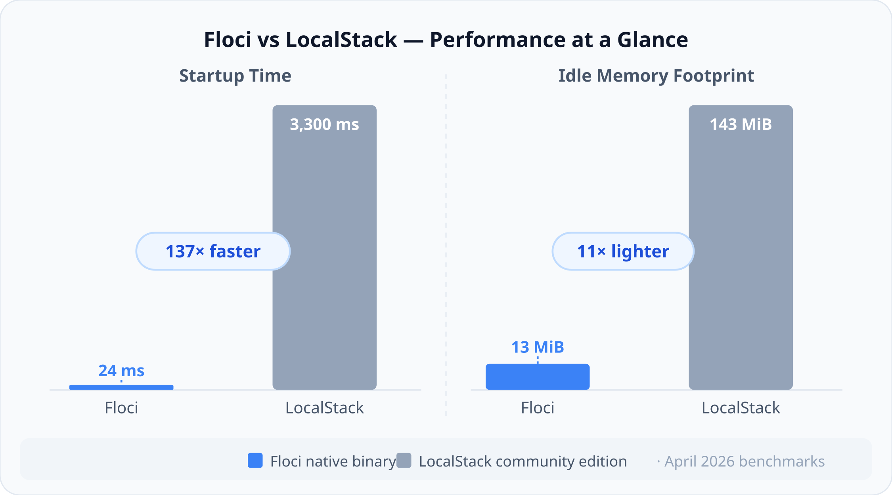
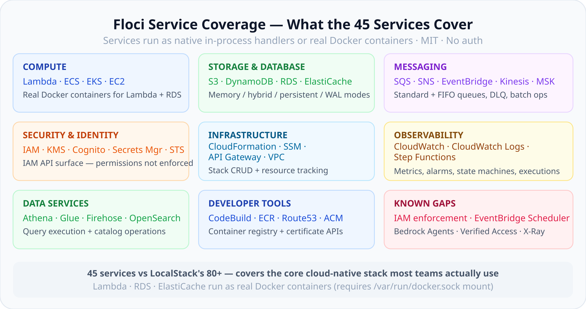
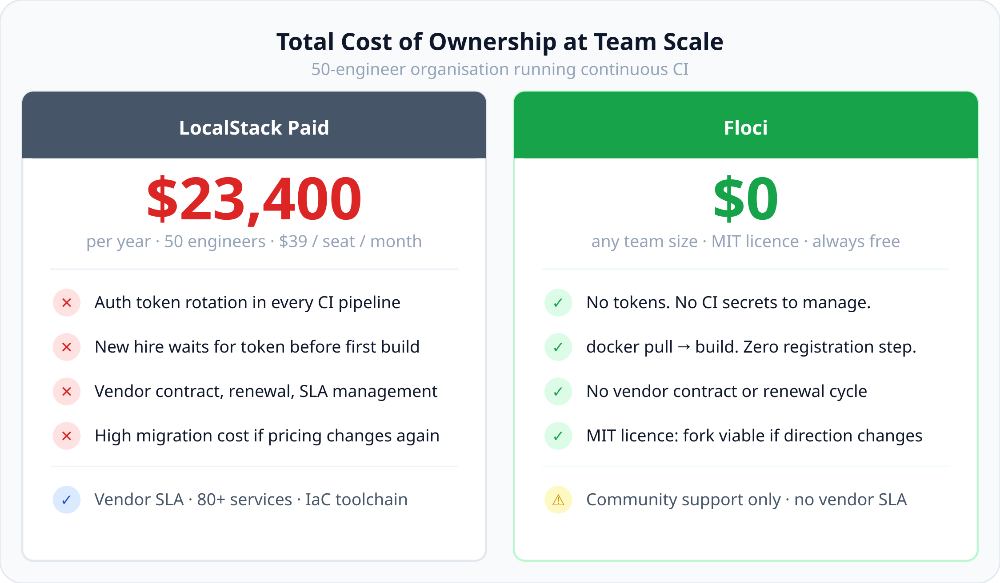
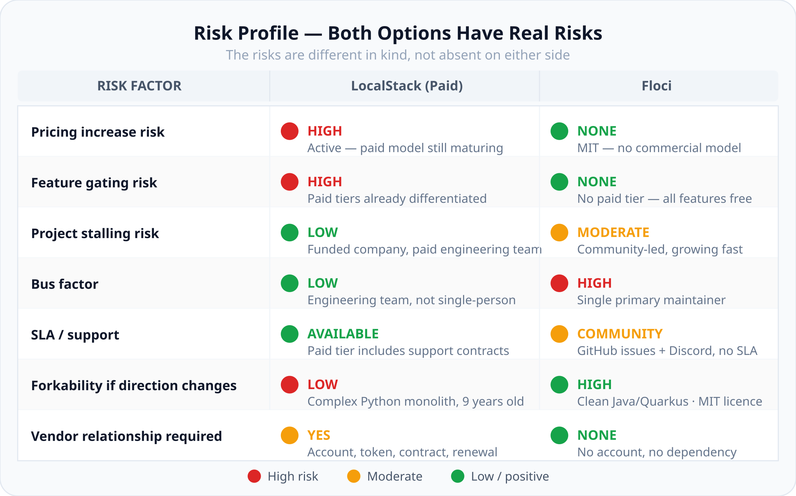
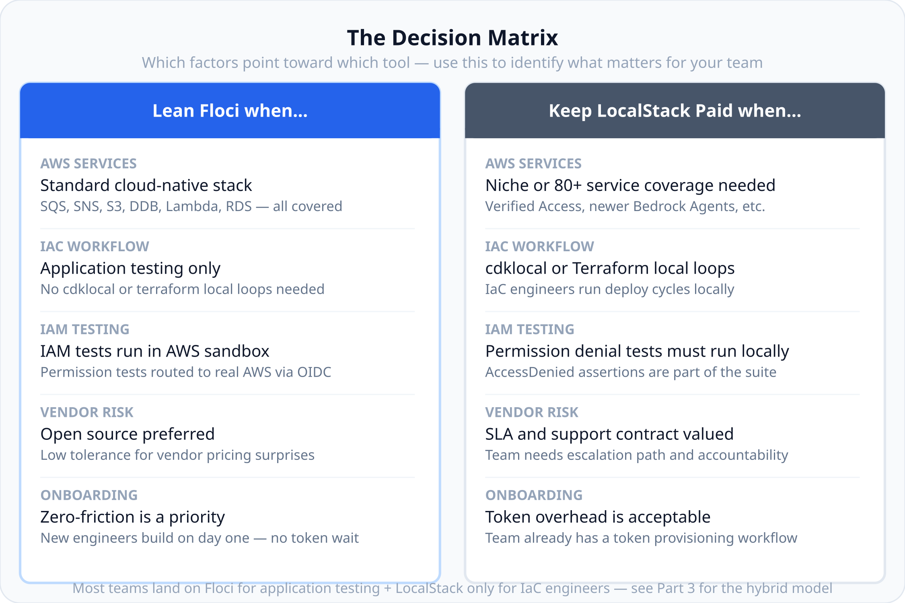
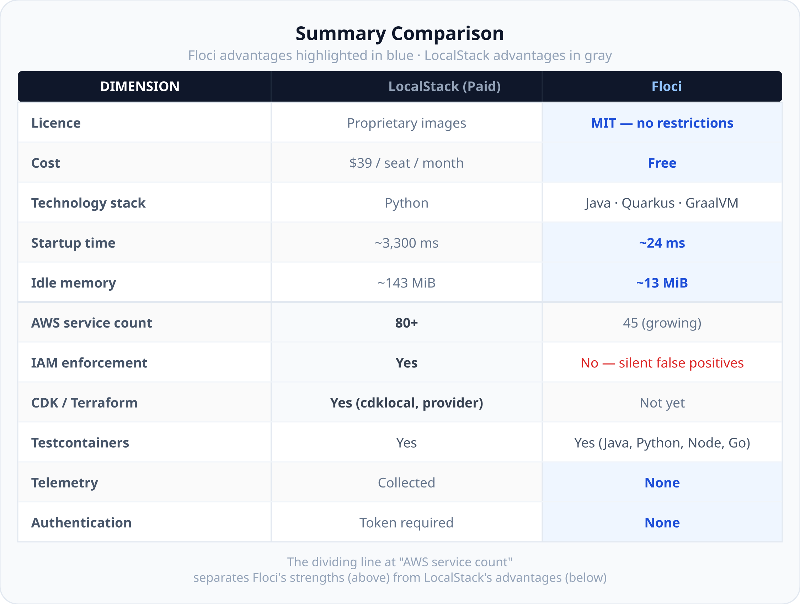

# LocalStack → Floci: The Complete 2026 Migration Guide

## Part 2: Making the Platform Decision — service coverage, TCO, IaC fit, and what the comparison actually tells you

---

_By Ashutosh Kumar | Project Manager & Engineering Tools Enthusiast | June 2026_

_Part 2 of 6 — LocalStack → Floci: The Complete 2026 Migration Guide_

---

_If you haven't read Part 1, it covers why the LocalStack community edition ended in March 2026 and how Floci emerged as the open-source response. This article is about the comparison itself — the dimensions that matter when making the platform decision._

---

Your team is asking which tool to use. The platform needs an answer.

Here's how I'd think through it — not as a feature checklist, but as an evaluation across the dimensions that drive long-term platform risk. Some of these will be decisive for your architecture; others won't matter at all. The goal is to know which is which before the decision, not after.

---

## Floci's Technology Stack: Why It's Worth Understanding

Before comparing capabilities, the technology stack is worth a few minutes because it directly explains the performance numbers, the reliability posture, and the ecosystem fit.

Floci is a free, open-source local AWS service emulator written in Java using Quarkus, compiled to a native binary via GraalVM Mandrel. The stack choices aren't random:

**Quarkus** is a Kubernetes-native Java framework developed and maintained by Red Hat. It underpins production workloads at large enterprises and is the foundation for Red Hat's managed Kubernetes offerings. Not an experimental side project — if you're trying to judge whether Floci will still be maintained in two years, the framework underneath it having enterprise-grade, commercial backing is a reasonable positive signal.

**GraalVM Mandrel** is the open-source, Red Hat-maintained distribution of GraalVM designed specifically for Quarkus native compilation. It compiles the entire application into a native binary ahead of time — no JVM, no class loading, no bytecode interpretation at runtime. The result is a binary that starts in approximately 24ms and idles at approximately 13 MiB. Compare that to LocalStack's ~3,300ms startup and ~143 MiB idle footprint. That gap is not rounding error.

**MIT licence on the binary**, not just the source. This is the distinction that separates Floci from LocalStack's post-2026 posture. MIT means commercial use is unrestricted, CI use is unrestricted, and any team could fork and maintain the codebase if the project direction ever changes.

Internally, Floci splits service handling into three tiers:

- **In-process handlers** for stateless services (SQS, SNS, SSM, IAM, KMS, Cognito, EventBridge, CloudWatch, and more) — fully in-memory, wire-protocol compatible, no external dependencies
- **Storage abstraction** for stateful services (S3, DynamoDB) — configurable backends: memory, persistent, hybrid, or WAL modes
- **Real Docker containers** for compute services (Lambda, RDS, ElastiCache, ECS, EKS) — actual runtimes, not mocks

That last point is worth emphasising. Lambda in Floci executes in a real container, which produces test results that are closer to production behaviour than you'd get from a shallow API mock.

---

## Service Coverage vs. Your Actual Architecture

The headline comparison is LocalStack at 80+ services vs. Floci at 45. For most platform decisions, that headline is less useful than a map of what your architecture actually uses.

**Floci covers the core cloud-native stack:**

**Where Floci currently falls short:**

- **IAM policy enforcement is not implemented.** IAM API calls succeed, but permissions aren't evaluated. Any test asserting an `AccessDenied` will silently pass when it shouldn't.
- **EventBridge Scheduler auto-execution** — scheduled rules don't fire automatically.
- **Niche or recently launched services** — Verified Access, newer Bedrock Agents features, Aurora Serverless v2 edge behaviours aren't confirmed.

Before committing either way, map your current AWS service usage — and your next 18 months of projected usage — against that list. For most standard cloud-native stacks, Floci covers what you actually need day-to-day. Where it doesn't, the hybrid approach in Part 3 fills the gap without requiring a full LocalStack licence.

---

## Total Cost of Ownership at Team Scale

The $39/seat/month figure is a starting point, not the full TCO calculation.

At 10+ engineers running continuous CI, the LocalStack licence becomes a meaningful budget line. But the comparison isn't purely financial — it's a comparison of what you're buying. LocalStack paid buys a vendor relationship with SLA and support channels. Floci's zero-cost profile shifts that investment toward internal capability and community engagement.

Neither is obviously correct. It depends on how much your team values vendor accountability versus autonomy.

---

## IaC Toolchain Fit: Floci's Clearest Current Gap

This is where the comparison gets lopsided.

**LocalStack paid** offers mature IaC integration:

- `cdklocal` — a CDK CLI wrapper that redirects deploys to LocalStack
- Terraform LocalStack provider — `terraform plan/apply` against local services
- Cloud Pods — snapshot and restore entire local stack state for reproducible environments
- LocalStack Desktop — visual inspection of running services and resources

**Floci** integrates well at the application layer, but not the IaC layer:

- Testcontainers modules for Java, Python, Node, Go
- Spring Boot 3.1+ `@ServiceConnection` via `@SpringBootTest`
- Quarkus Dev Services (integration proposed and in active development)
- Standard Docker Compose with `LOCALSTACK_PARITY=true`

CDK and Terraform local integration aren't on Floci's released roadmap yet.

If your platform engineers use `cdklocal deploy` or `terraform apply` against a local environment as part of their development loop, Floci can't replicate that workflow today. That's the clearest current argument for maintaining a LocalStack paid licence — not for application development, but specifically for IaC development and validation.

---

## Risk Profile: Both Options Have Real Risks

Both tools carry real risk — just different kinds. It's worth looking at this honestly rather than assuming Floci is "safe" because it's free.

Floci's bus factor is the one I'd watch. Monitor the contributor graph on GitHub — a project gaining multiple active maintainers is measurably more resilient. Floci's 10,000-star momentum is attracting contributors, but governance is still maturing. If you're evaluating this in Q4 2026 or later, that picture may have changed significantly.

---

## Ecosystem and Enterprise Readiness

**LocalStack paid** brings nine years of accumulated ecosystem:

- Extensive documentation across all 80+ services
- Official CI integrations (GitHub Actions, CircleCI, Jenkins)
- Enterprise support contracts
- Chaos Engineering extension for failure simulation
- Cloud Pods for environment state management

**Floci** is six months old and it shows — the ecosystem is thin compared to nine years of LocalStack tooling. That said, Quarkus and GraalVM underneath it are mature, Red Hat-maintained, and production-tested at scale. The framework isn't new; the application built on it is. Whether that distinction matters depends on your team's risk tolerance in year one.

---

## The Decision Matrix

---

## Summary Comparison

---

## What Part 3 Covers

Treating this as a binary choice — Floci or LocalStack — misses the more practical option: use both, deliberately, for the things each does well. Part 3 covers that model in detail, including how to handle IaC workflows and IAM testing without a full LocalStack licence for everyone.

Parts 4–6 get into the hands-on work: docker-compose configs, CI pipeline changes, service benchmarks, edge cases, and Testcontainers integration in Java, Python, and Go.

---

_What gaps in Floci's coverage are blocking your team's migration decision? Drop them in the comments — the community is actively prioritising service coverage based on real migration blockers._

---

**Tags:** `#CloudArchitecture` `#LocalStack` `#Floci` `#AWSStrategy` `#TechLeadership` `#TCO` `#Quarkus` `#GraalVM` `#OpenSource` `#PlatformEngineering`

---

_About the author: Ashutosh Kumar is a Project Manager with 15 years of experience, currently exploring developer tooling, cloud workflows, and engineering process improvements. He writes at github.com/askuma._
