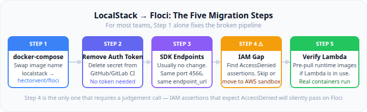

# LocalStack → Floci: The Complete 2026 Migration Guide

## Part 4: The Migration Steps — docker-compose, CI configs, SDK setup, and the IAM gotcha

---

_By Ashutosh Kumar | Project Manager & Engineering Tools Enthusiast | June 2026_

_Part 4 of 6 — LocalStack → Floci: The Complete 2026 Migration Guide_

---

Your LocalStack pipeline broke on March 23, 2026 when the community edition moved behind mandatory authentication. You need the fix. This article gives you the exact steps — docker-compose before/after, CI pipeline configs, SDK endpoint settings in Python, Node.js, and Java, and the one IAM gotcha you'll hit on Floci.

No preamble. Let's go.



---

## What Floci Is (30-Second Version)

Floci is a free, open-source local AWS service emulator written in Java using Quarkus and compiled to a native binary via GraalVM Mandrel. MIT licence, no authentication, no telemetry, port 4566 — same as LocalStack. Starts in 24ms, idles at 13 MiB. Named after _cirrocumulus floccus_, the small, lightweight cloud formation.

For most teams, the migration is literally a one-line change to the image name. The rest of this article covers the cases that aren't one-liners.

---

## Quick Numbers Before You Start

| Metric              | LocalStack         | Floci            |
| ------------------- | ------------------ | ---------------- |
| Auth token required | Yes (March 2026+)  | Never            |
| Startup time        | ~3,300 ms          | ~24 ms           |
| Idle memory         | ~143 MiB           | ~13 MiB          |
| Image size          | ~1.0 GB            | ~276 MB          |
| Licence             | Proprietary images | MIT              |
| Port                | 4566               | 4566 (identical) |
| AWS services        | 80+                | 45               |
| IAM enforcement     | Yes                | No               |
| Cost                | $39/seat/month     | Free             |

---

## Step 1: Update docker-compose.yml

```yaml
# BEFORE — LocalStack with auth token
services:
  localstack:
    image: localstack/localstack
    ports:
      - "4566:4566"
    environment:
      - SERVICES=s3,sqs,dynamodb,lambda
      - LOCALSTACK_AUTH_TOKEN: ${LOCALSTACK_AUTH_TOKEN}

# AFTER — Floci, no auth needed
services:
  floci:
    image: hectorvent/floci:latest
    ports:
      - "4566:4566"
    volumes:
      - /var/run/docker.sock:/var/run/docker.sock   # required for Lambda, RDS, ECS, EKS
    environment:
      - FLOCI_DEFAULT_REGION=us-east-1
      - FLOCI_STORAGE_MODE=memory    # memory | hybrid | persistent | wal
      - LOCALSTACK_PARITY=true       # auto-translates LOCALSTACK_* env vars
```

Two things to watch for:

Drop the `SERVICES=` line entirely. Floci starts everything by default — there's no selective loading, and that variable does nothing.

The docker socket mount is only needed for Lambda, RDS, ElastiCache, ECS, and EKS — services that spin up real containers underneath. If you're only running S3, SQS, DynamoDB, and similar stateless services, you don't need it.

Storage modes in case you need to tune them:

- `memory` — data gone on container stop; fastest, use this in CI
- `hybrid` — default; in-memory with async disk flush every 5 seconds
- `persistent` — full disk persistence across restarts
- `wal` — write-ahead log for stateful dev environments that need durability

---

## Step 2: Remove Auth Token from CI

**GitHub Actions — before:**

```yaml
- name: Start LocalStack
  uses: LocalStack/setup-localstack@v2
  with:
    image-tag: latest
  env:
    LOCALSTACK_AUTH_TOKEN: ${{ secrets.LOCALSTACK_AUTH_TOKEN }}
```

**GitHub Actions — after:**

```yaml
- name: Start Floci
  run: docker compose up -d floci

- name: Wait for Floci health check
  run: |
    echo "Waiting for Floci..."
    timeout 15 bash -c 'until curl -sf http://localhost:4566/_floci/health > /dev/null; do sleep 0.5; done'
    echo "Floci ready"
```

Floci starts in ~24ms. The health check loop almost always exits on the first iteration. The `timeout 15` is generous safety margin — you won't actually need 15 seconds.

Also remove `LOCALSTACK_AUTH_TOKEN` from your repository secrets if it was only used for LocalStack.

**GitLab CI — before:**

```yaml
integration-tests:
  services:
    - name: localstack/localstack
      alias: localstack
  variables:
    LOCALSTACK_AUTH_TOKEN: ${LOCALSTACK_AUTH_TOKEN}
    AWS_ENDPOINT_URL: http://localstack:4566
```

**GitLab CI — after:**

```yaml
integration-tests:
  services:
    - name: hectorvent/floci:latest
      alias: floci
      variables:
        LOCALSTACK_PARITY: "true"
        FLOCI_STORAGE_MODE: memory
  variables:
    AWS_ENDPOINT_URL: http://floci:4566
    AWS_DEFAULT_REGION: us-east-1
    AWS_ACCESS_KEY_ID: test
    AWS_SECRET_ACCESS_KEY: test
```

In GitLab CI, use the service alias (`floci`) as the hostname, not `localhost`.

---

## Step 3: AWS SDK Endpoint Configuration

Application code doesn't need to change. Floci listens on port 4566, same as LocalStack. If you were already configuring `endpoint_url` or `endpointOverride`, it carries over unchanged.

**Python — boto3:**

```python
import boto3

# No changes needed from LocalStack config
s3 = boto3.client(
    "s3",
    endpoint_url="http://localhost:4566",
    region_name="us-east-1",
    aws_access_key_id="test",
    aws_secret_access_key="test"
)

sqs = boto3.client(
    "sqs",
    endpoint_url="http://localhost:4566",
    region_name="us-east-1",
    aws_access_key_id="test",
    aws_secret_access_key="test"
)
```

**Node.js — AWS SDK v3:**

```javascript
import { S3Client } from "@aws-sdk/client-s3";
import { SQSClient } from "@aws-sdk/client-sqs";

// No changes needed from LocalStack config
const config = {
  endpoint: "http://localhost:4566",
  region: "us-east-1",
  credentials: { accessKeyId: "test", secretAccessKey: "test" },
  forcePathStyle: true, // keep this — required for S3 on Floci same as LocalStack
};

const s3 = new S3Client(config);
const sqs = new SQSClient(config);
```

**Java — AWS SDK v2:**

```java
import software.amazon.awssdk.auth.credentials.AwsBasicCredentials;
import software.amazon.awssdk.auth.credentials.StaticCredentialsProvider;
import software.amazon.awssdk.regions.Region;
import software.amazon.awssdk.services.s3.S3Client;

// No changes needed from LocalStack config
S3Client s3 = S3Client.builder()
    .endpointOverride(URI.create("http://localhost:4566"))
    .region(Region.US_EAST_1)
    .credentialsProvider(StaticCredentialsProvider.create(
        AwsBasicCredentials.create("test", "test")))
    .serviceConfiguration(S3Configuration.builder()
        .pathStyleAccessEnabled(true)  // keep this
        .build())
    .build();
```

---

## Step 4: Handle the IAM Enforcement Gap

This is the step that catches teams off guard. Floci's IAM surface accepts all API calls — permissions are not evaluated. If any of your tests assert that a permission denial occurs, those tests will fail silently: the call succeeds where it should have been denied, and the assertion expecting an exception never fires.

The dangerous part isn't that the test errors out — it's that it passes when it shouldn't.

**Find IAM assertion tests in your test suite first:**

```bash
grep -r "AccessDenied" tests/
grep -r "is not authorized" tests/
grep -r "ClientError" tests/ | grep -i "iam\|access\|denied\|forbidden"
```

**Option A — Skip on Floci environments:**

```python
import pytest
import os

USING_FLOCI = os.getenv("AWS_EMULATOR", "floci") == "floci"

@pytest.mark.skipif(USING_FLOCI, reason="IAM not enforced in Floci — run against real AWS sandbox")
def test_unauthorized_bucket_access():
    with pytest.raises(ClientError) as exc:
        s3.get_object(Bucket="restricted", Key="secret.txt")
    assert exc.value.response["Error"]["Code"] == "AccessDenied"
```

**Option B — Move to AWS sandbox CI stage:**

```yaml
# .github/workflows/integration.yml
jobs:
  # Floci for fast integration tests
  floci-tests:
    runs-on: ubuntu-latest
    steps:
      - run: pytest tests/integration/ -m "not iam_boundary"

  # Real AWS for IAM boundary tests (separate job, OIDC credentials)
  iam-boundary-tests:
    runs-on: ubuntu-latest
    permissions:
      id-token: write
      contents: read
    steps:
      - uses: aws-actions/configure-aws-credentials@v4
        with:
          role-to-assume: arn:aws:iam::ACCOUNT:role/ci-iam-test-role
          aws-region: us-east-1
      - run: pytest tests/integration/ -m "iam_boundary"
```

---

## Step 5: Verify Lambda Works (If You Use It)

Floci runs Lambda in real Docker containers. The first invocation triggers a container pull for the Lambda runtime image if it's not already cached in your CI runner. This can add several seconds to the first Lambda test on a fresh runner.

**Pre-warm Lambda runtime images in CI:**

```yaml
- name: Pre-pull Lambda runtime images
  run: |
    docker pull public.ecr.aws/lambda/python:3.12
    docker pull public.ecr.aws/lambda/nodejs:20
    # Pull only the runtimes your functions use
```

**Verify Lambda is working after Floci starts:**

```bash
# Create a test function
aws --endpoint-url=http://localhost:4566 \
    --region us-east-1 \
    lambda create-function \
    --function-name test-fn \
    --runtime python3.12 \
    --role arn:aws:iam::000000000000:role/lambda-role \
    --handler index.handler \
    --zip-file fileb://function.zip

# Invoke it
aws --endpoint-url=http://localhost:4566 \
    --region us-east-1 \
    lambda invoke \
    --function-name test-fn \
    --payload '{"key": "value"}' \
    output.json

cat output.json
```

---

## Full GitHub Actions Example (End-to-End)

```yaml
name: Integration Tests

on:
  push:
    branches: [main, develop]
  pull_request:

jobs:
  integration:
    runs-on: ubuntu-latest

    services:
      floci:
        image: hectorvent/floci:latest
        ports:
          - 4566:4566
        options: >-
          --health-cmd "curl -sf http://localhost:4566/_floci/health"
          --health-interval 2s
          --health-timeout 5s
          --health-retries 10
        volumes:
          - /var/run/docker.sock:/var/run/docker.sock
        env:
          FLOCI_STORAGE_MODE: memory
          LOCALSTACK_PARITY: "true"

    env:
      AWS_DEFAULT_REGION: us-east-1
      AWS_ACCESS_KEY_ID: test
      AWS_SECRET_ACCESS_KEY: test
      AWS_ENDPOINT_URL: http://localhost:4566
      AWS_EMULATOR: floci

    steps:
      - uses: actions/checkout@v4

      - name: Set up Python 3.12
        uses: actions/setup-python@v5
        with:
          python-version: "3.12"
          cache: pip

      - name: Install dependencies
        run: pip install -r requirements.txt

      - name: Run integration tests (excluding IAM boundary)
        run: pytest tests/integration/ -m "not iam_boundary" -v --tb=short

      - name: Upload test results
        if: always()
        uses: actions/upload-artifact@v4
        with:
          name: test-results
          path: reports/
```

---

## Before You Merge

- [ ] `image: localstack/localstack` replaced with `hectorvent/floci:latest`
- [ ] `LOCALSTACK_AUTH_TOKEN` removed from docker-compose and CI secrets
- [ ] `SERVICES=` variable removed (Floci starts all services by default)
- [ ] `/var/run/docker.sock` mounted (only if using Lambda, RDS, ECS, EKS)
- [ ] `FLOCI_STORAGE_MODE=memory` set in CI for fastest performance
- [ ] `LOCALSTACK_PARITY=true` set if any `LOCALSTACK_*` env vars remain
- [ ] IAM assertion tests identified and either skipped or moved to AWS sandbox stage
- [ ] Lambda runtime images pre-pulled in CI if Lambda is in use
- [ ] Health check updated to use `/_floci/health` endpoint
- [ ] `forcePathStyle: true` (or equivalent) remains set for S3 clients

---

## Up Next

Part 5 gets into Floci's internals — the technology stack, full service coverage map, benchmark numbers, and the seven edge cases teams most commonly hit after migration.

Part 6 is the Testcontainers guide: Spring Boot `@ServiceConnection`, Python pytest setup, Go integration tests, the hybrid docker-compose for teams with coverage gaps, and what to do if a gap genuinely blocks the full migration.

---

_Hit a specific error during migration that isn't covered here? Drop it in the comments — the community is building a shared troubleshooting knowledge base for the LocalStack → Floci transition._

---

**Tags:** `#PlatformEngineering` `#DevOps` `#LocalStack` `#Floci` `#AWS` `#CI/CD` `#Docker` `#Migration` `#OpenSource` `#CloudNative`

---

_About the author: Ashutosh Kumar is a Project Manager with 15 years of experience, currently exploring developer tooling, cloud workflows, and engineering process improvements. He writes at github.com/askuma._
