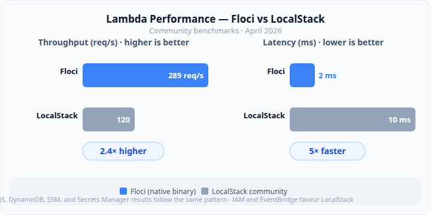

# LocalStack → Floci: The Complete 2026 Migration Guide

## Part 5: Coverage, Benchmarks, and Known Gaps

---

_By Ashutosh Kumar | Project Manager & Engineering Tools Enthusiast | June 2026_

_Part 5 of 6 — LocalStack → Floci: The Complete 2026 Migration Guide_

---

_Part 4 covered the exact migration steps. This one goes deeper: Floci's technology stack and what it means operationally, the complete service coverage map, service-level benchmark numbers, and the specific edge cases that appear after the initial migration succeeds._

---

## Why the Technology Stack Matters

Most engineers care about what a tool does, not what it's built on. Fair enough — until the day the tool behaves unexpectedly and you need to understand why, or until you're evaluating whether it'll still be maintained two years from now.

Floci is a free, open-source local AWS service emulator written in Java using Quarkus and compiled to a native binary via GraalVM Mandrel.

**Java** — a deliberate choice for this type of tool. The AWS SDK's Java implementation and the DynamoDB wire protocol have deep Java-optimised parsing libraries available. Community benchmark data shows this directly: Floci consistently outperforms LocalStack on DynamoDB operations, which the Java parsing stack almost certainly explains.

**Quarkus** — a Kubernetes-native Java framework from Red Hat, used in production on Red Hat OpenShift. Not experimental. For platform engineers assessing how long a new tool will be maintained, the framework it sits on having commercial-grade, Red Hat-backed maintenance is a meaningful signal. Quarkus's reactive model (Vert.x and Mutiny) handles concurrent AWS SDK requests without the thread-per-request overhead of traditional Java web frameworks — which explains the throughput numbers.

**GraalVM Mandrel** — Red Hat's open-source distribution of GraalVM, specifically designed for Quarkus native compilation. At build time, the Quarkus application is compiled into a native binary via ahead-of-time (AOT) compilation. The entire dependency graph is resolved at compile time, dead code is eliminated, and the result is a single self-contained binary with no JVM, no class loader, and no JIT compiler at runtime.

That produces the performance profile you see:

| Metric               | Floci (Native) | Floci (JVM mode) | LocalStack |
| -------------------- | -------------- | ---------------- | ---------- |
| Startup time         | ~24 ms         | ~684 ms          | ~3,300 ms  |
| Idle memory          | ~13 MiB        | ~78 MiB          | ~143 MiB   |
| Lambda throughput    | 289 req/s      | —                | 120 req/s  |
| Lambda latency (avg) | 2 ms           | —                | 10 ms      |

The Docker image ships the native binary. You're not running a JVM in the container — you're running a compiled binary, which is why the image is 276MB rather than the 1.0GB+ of LocalStack.

**MIT licence on the binary**, not just the source. No authentication, no feature gating, no telemetry. One container, one port, no overhead.

---

## How Floci Handles Services Internally

Worth knowing because it affects what to expect from memory usage, test reliability, and why some services need the Docker socket while others don't.

**Tier 1 — In-process stateless handlers**

SQS, SNS, SSM, IAM, STS, KMS, Secrets Manager, Cognito, EventBridge, CloudWatch, CloudWatch Logs, Step Functions, CloudFormation, ACM, API Gateway, Route53, Kinesis, Athena, Glue, Data Firehose, and Bedrock Runtime stubs all run as native in-process handlers within the Floci binary. No external processes, no network hops, no Docker. Wire-protocol compatible.

**Tier 2 — Storage abstraction for stateful services**

S3 and DynamoDB run in-process with configurable persistence backends:

```
FLOCI_STORAGE_MODE=memory     → Fastest, state lost on restart (CI default)
FLOCI_STORAGE_MODE=hybrid     → In-memory + async disk flush every 5s (default)
FLOCI_STORAGE_MODE=persistent → Full disk persistence across restarts
FLOCI_STORAGE_MODE=wal        → Write-ahead log for maximum durability
```

**Tier 3 — Real Docker containers for compute services**

Lambda, RDS, ElastiCache, ECS, EKS, MSK, OpenSearch, and CodeBuild spin up actual Docker containers via the Docker API. This is why `/var/run/docker.sock` must be mounted — Floci calls the Docker daemon directly. Lambda in Floci executes your actual function code in a real runtime container. RDS is a real PostgreSQL or MySQL container with JDBC wire protocol proxying.

---

## Complete Service Coverage Map

### Fully Supported — In-Process

| Service                 | Key Features Supported                                                          |
| ----------------------- | ------------------------------------------------------------------------------- |
| **SQS**                 | Standard & FIFO queues, DLQ, visibility timeout, batch operations, tagging      |
| **SNS**                 | Topics, subscriptions, SQS/Lambda/HTTP delivery, tagging                        |
| **S3**                  | Versioning, multipart upload, pre-signed URLs, Object Lock, event notifications |
| **DynamoDB**            | GSI/LSI, Query, Scan, TTL, transactions, batch operations                       |
| **DynamoDB Streams**    | Shard iterators, records, Lambda ESM trigger                                    |
| **SSM Parameter Store** | Version history, labels, SecureString, tagging                                  |
| **Secrets Manager**     | Create, retrieve, rotate (mock), versioning                                     |
| **KMS**                 | Key creation, encrypt/decrypt, aliases                                          |
| **Cognito**             | User pools, identity pools, authentication flows                                |
| **IAM**                 | Full API surface — key caveat: permissions not evaluated                        |
| **STS**                 | AssumeRole, GetCallerIdentity, session tokens                                   |
| **EventBridge**         | Rules, targets, buses — Scheduler auto-execution gap (see below)                |
| **CloudWatch**          | Metrics, alarms, dashboards                                                     |
| **CloudWatch Logs**     | Log groups, streams, put/get events                                             |
| **Step Functions**      | State machine definition, execution, history                                    |
| **API Gateway REST**    | Resources, methods, stages, Lambda proxy integration                            |
| **Route53**             | Hosted zones, record sets                                                       |
| **Kinesis**             | Streams, shards, put/get records                                                |
| **CloudFormation**      | Stack create/update/delete, resource tracking                                   |
| **ACM**                 | Certificate request and retrieval                                               |
| **Athena**              | Query execution (metadata level)                                                |
| **Glue**                | Catalog operations                                                              |
| **Data Firehose**       | Delivery stream operations                                                      |
| **Bedrock Runtime**     | Model invocation stubs — returns mock responses                                 |

### Supported via Real Docker Containers

| Service         | How It Works                                                                                        | Requirement            |
| --------------- | --------------------------------------------------------------------------------------------------- | ---------------------- |
| **Lambda**      | Real runtime container per function; warm pool; aliases; Function URLs; SQS/Kinesis/DDB Streams ESM | `/var/run/docker.sock` |
| **RDS**         | Real PostgreSQL or MySQL container; JDBC wire protocol proxying                                     | `/var/run/docker.sock` |
| **ElastiCache** | Real Redis or Valkey container; RESP protocol; SigV4 token validation                               | `/var/run/docker.sock` |
| **ECS**         | Task spin-up via Docker                                                                             | `/var/run/docker.sock` |
| **EKS**         | k3s-based Kubernetes emulation                                                                      | `/var/run/docker.sock` |
| **MSK**         | Real Kafka container                                                                                | `/var/run/docker.sock` |
| **OpenSearch**  | Real OpenSearch container                                                                           | `/var/run/docker.sock` |
| **CodeBuild**   | Build execution in real container                                                                   | `/var/run/docker.sock` |
| **ECR**         | Container registry API                                                                              | `/var/run/docker.sock` |

### Current Gaps

| Gap                                     | Detail                                       |
| --------------------------------------- | -------------------------------------------- |
| IAM policy enforcement                  | API calls succeed; permissions not evaluated |
| EventBridge Scheduler auto-execution    | Scheduled rules don't fire automatically     |
| Bedrock Agents (beyond stubs)           | Complex agent workflows not simulated        |
| Aurora Serverless v2 edge behaviours    | Not confirmed                                |
| AWS Verified Access                     | Not yet covered                              |
| X-Ray tracing                           | Not implemented                              |
| Detailed CloudFormation drift detection | Metadata only                                |

---

## Service-Level Benchmarks



Community benchmarks from April 2026 across 30 API operations and throughput tests:

| Service / Operation       | Floci       | LocalStack | Winner         | Notes                                |
| ------------------------- | ----------- | ---------- | -------------- | ------------------------------------ |
| S3 small reads            | Faster      | —          | **Floci**      | Edges ahead                          |
| S3 large writes (100KB)   | ~31% faster | —          | **Floci**      | Significant margin                   |
| SQS individual operations | Faster      | —          | **Floci**      | Consistent                           |
| SQS sustained throughput  | —           | —          | MiniStack\*    | Floci still ahead of LocalStack      |
| DynamoDB reads            | Faster      | —          | **Floci**      | Java JSON parsing advantage          |
| DynamoDB writes           | Faster      | —          | **Floci**      | Same reason                          |
| Lambda latency (avg)      | 2 ms        | 10 ms      | **Floci**      | 5x faster                            |
| Lambda throughput         | 289 req/s   | 120 req/s  | **Floci**      | 2.4x higher                          |
| SSM                       | Faster      | —          | **Floci**      | —                                    |
| Secrets Manager           | Faster      | —          | **Floci**      | —                                    |
| CloudWatch                | Faster      | —          | **Floci**      | —                                    |
| IAM operations            | —           | Faster     | **LocalStack** | Enforces policy; more work per call  |
| EventBridge PutEvents     | —           | Faster     | **LocalStack** | —                                    |
| Route53                   | Works       | Unreliable | **Floci**      | Route53 only works reliably on Floci |

\*MiniStack is a third alternative (211MB Alpine-based image, MIT licensed) that edges out Floci on sustained SQS throughput but has less service depth overall.

---

## Known Edge Cases After Migration

These are the specific failures reported by teams who migrated from LocalStack to Floci in March–May 2026. Most teams hit two or three of these — knowing about them in advance saves hours of debugging.

**1. IAM `AccessDenied` assertions fail silently**

The test doesn't error out. The IAM call succeeds, and the assertion expecting `ClientError` with `AccessDenied` never fires. The test passes when it shouldn't. This is the most dangerous edge case because it produces false positives, not failures.

_Detection:_ `grep -r "AccessDenied" tests/` and `grep -r "is not authorized" tests/`

_Fix:_ Skip with `pytest.mark.skipif` or move to an AWS sandbox CI stage.

**2. EventBridge Scheduler rules never trigger**

Tests that wait for time-based EventBridge rules to fire will hang or time out. Floci accepts the Scheduler API but doesn't auto-execute scheduled rules.

_Fix:_ Test scheduling logic and execution logic in separate test units. Invoke the target directly in tests rather than waiting for the scheduler to fire.

**3. Lambda cold start on first CI run**

The Lambda runtime container image must be pulled on first use. On a fresh CI runner without cached images, this adds 10–30 seconds to the first Lambda invocation.

_Fix:_

```yaml
- name: Pre-pull Lambda runtimes
  run: |
    docker pull public.ecr.aws/lambda/python:3.12
    docker pull public.ecr.aws/lambda/nodejs:20
    docker pull public.ecr.aws/lambda/java:21
```

**4. S3 path-style not explicitly set**

If `forcePathStyle` (Node.js) or `addressing_style=path` (Python) wasn't explicitly set and happened to work with LocalStack due to a quirk, it will fail on Floci. Both require explicit path-style configuration.

_Fix:_ Make sure path-style is set explicitly in all S3 clients.

**5. Missing `FLOCI_DEFAULT_REGION` causes region mismatch errors**

If the AWS SDK is configured with a region that doesn't match Floci's default, some service calls return region mismatch errors.

_Fix:_

```yaml
environment:
  - FLOCI_DEFAULT_REGION=us-east-1 # must match your SDK region config
```

**6. Docker-in-Docker not available in CI runner**

If your CI runner doesn't have Docker-in-Docker (DIND) capability, mounting `/var/run/docker.sock` fails. Floci's compute services — Lambda, RDS, ECS — are then unavailable.

_Fix:_ Enable DIND on your CI runner, or route compute service tests to an alternative: moto for Python Lambda mocking, DynamoDB Local for DynamoDB. Check Docker access before committing to Floci for Lambda-heavy workloads.

**7. SQS FIFO message ordering edge cases**

Community-reported edge cases with MessageGroupId deduplication under high-concurrency scenarios. Not consistently reproducible, but worth knowing about for FIFO-critical workloads.

_Fix:_ Run FIFO-critical tests against ElasticMQ (`softwaremill/elasticmq-native`), which has a longer fidelity track record for SQS FIFO edge cases.

---

## Right-Sizing CI Runners

Floci's resource profile means you can run leaner runners than you needed for LocalStack:

| Scenario                           | Recommended Runner                         |
| ---------------------------------- | ------------------------------------------ |
| Floci only, no Lambda/RDS          | 1 vCPU, 512MB RAM minimum                  |
| Floci with Lambda/RDS              | 2 vCPU, 2GB RAM (containers need headroom) |
| Parallel test jobs (5x) with Floci | 2 vCPU, 1GB RAM per job                    |
| LocalStack equivalent              | 2 vCPU, 4GB RAM minimum                    |

Floci's 13 MiB idle footprint means multiple parallel instances can run on a single runner without memory contention. For organisations with high-parallelism test pipelines, this is a meaningful CI cost reduction.

---

## Up Next

Part 6 is the Testcontainers guide — Spring Boot `@ServiceConnection`, Python pytest fixtures, Go integration tests, the hybrid docker-compose for teams running Floci alongside specialist tools, and the rollback plan for when a specific gap blocks completing the migration.

---

_Which edge case did you hit that isn't on this list? Drop it in the comments — a complete migration edge case registry helps the whole community._

---

**Tags:** `#PlatformEngineering` `#AWS` `#Floci` `#LocalStack` `#Quarkus` `#GraalVM` `#Benchmarks` `#DevOps` `#CloudNative` `#OpenSource`

---

_About the author: Ashutosh Kumar is a Project Manager with 15 years of experience, currently exploring developer tooling, cloud workflows, and engineering process improvements. He writes at github.com/askuma._
