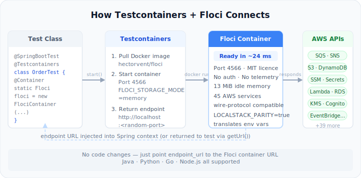

# LocalStack → Floci: The Complete 2026 Migration Guide

## Part 6: Testcontainers Integration — Java, Python, Go, hybrid docker-compose, and the rollback plan

---

_By Ashutosh Kumar | Project Manager & Engineering Tools Enthusiast | June 2026_

_Part 6 of 6 — LocalStack → Floci: The Complete 2026 Migration Guide_

---

_Part 4 covered migration steps and CI configs. Part 5 covered the technology stack, service map, benchmarks, and edge cases. This final article covers Testcontainers integration across Java, Python, and Go, the hybrid multi-tool setup for teams with coverage gaps, and the rollback plan for when a gap genuinely blocks completing the migration._

---

## Why Testcontainers + Floci Actually Works

Floci ships Testcontainers modules for Java, Python, Node.js, and Go. The combination works well for a simple reason: Floci starts in ~24ms. The startup overhead that makes Testcontainers feel slow with heavier images is basically gone. A `@SpringBootTest` that used to sit waiting 5+ seconds for LocalStack to come up typically finishes in under half a second with Floci.



---

## Java — Spring Boot with @ServiceConnection

Spring Boot 3.1+ supports `@ServiceConnection` via Testcontainers, which autowires endpoint configuration directly into the Spring context. No manual `endpoint_url` injection required.

**Dependencies (Maven):**

```xml
<dependency>
    <groupId>org.springframework.boot</groupId>
    <artifactId>spring-boot-testcontainers</artifactId>
    <scope>test</scope>
</dependency>
<dependency>
    <groupId>io.floci</groupId>
    <artifactId>floci-testcontainers-java</artifactId>
    <version>0.3.0</version>
    <scope>test</scope>
</dependency>
```

**Basic integration test:**

```java
@SpringBootTest
@Testcontainers
class OrderServiceIntegrationTest {

    @Container
    @ServiceConnection
    static FlociContainer floci = new FlociContainer("hectorvent/floci:latest")
        .withEnv("FLOCI_STORAGE_MODE", "memory")
        .withEnv("FLOCI_DEFAULT_REGION", "us-east-1");

    @Autowired
    private OrderService orderService;

    @Test
    void shouldPlaceOrderAndPublishToSqs() {
        // Spring automatically uses Floci's endpoint — no manual config
        Order order = orderService.placeOrder("ITEM-001", 3);

        assertThat(order.getStatus()).isEqualTo(OrderStatus.PLACED);
        // Assert SQS message was published
        assertThat(sqsHelper.receiveMessage("orders-queue")).isNotEmpty();
    }
}
```

**Multi-service test with specific services:**

```java
@SpringBootTest
@Testcontainers
class InventoryIntegrationTest {

    @Container
    @ServiceConnection
    static FlociContainer floci = new FlociContainer("hectorvent/floci:latest")
        .withServices("s3", "sqs", "dynamodb", "secrets-manager")
        .withEnv("FLOCI_STORAGE_MODE", "memory")
        .withCreateContainerCmdModifier(cmd ->
            cmd.withHostConfig(HostConfig.newHostConfig()
                .withBinds(new Bind("/var/run/docker.sock",
                    new Volume("/var/run/docker.sock")))));
        // Docker socket required only if Lambda is in withServices()

    @Test
    void shouldStoreInventoryInDynamoDb() { ... }

    @Test
    void shouldUploadReportToS3() { ... }
}
```

**Shared container across test classes (faster test suite):**

```java
// Base class — one Floci container for the whole test suite
@Testcontainers
public abstract class FlociIntegrationBase {

    @Container
    static FlociContainer floci = new FlociContainer("hectorvent/floci:latest")
        .withEnv("FLOCI_STORAGE_MODE", "memory");

    static {
        floci.start();
        System.setProperty("aws.endpoint-url", floci.getEndpointUrl());
        System.setProperty("aws.region", "us-east-1");
        System.setProperty("aws.accessKeyId", "test");
        System.setProperty("aws.secretAccessKey", "test");
    }
}

// Test classes extend the base — no per-class container startup
class S3ServiceTest extends FlociIntegrationBase {
    @Test
    void shouldUploadFile() { ... }
}

class SqsConsumerTest extends FlociIntegrationBase {
    @Test
    void shouldConsumeMessage() { ... }
}
```

---

## Python — pytest with Testcontainers

**Install:**

```bash
pip install testcontainers-floci boto3 pytest
```

**conftest.py — session-scoped Floci container:**

```python
import boto3
import pytest
from testcontainers.floci import FlociContainer

@pytest.fixture(scope="session")
def floci_container():
    with FlociContainer("hectorvent/floci:latest") \
            .with_env("FLOCI_STORAGE_MODE", "memory") \
            .with_env("FLOCI_DEFAULT_REGION", "us-east-1") as container:
        yield container

@pytest.fixture(scope="session")
def aws_endpoint(floci_container):
    return floci_container.get_url()

@pytest.fixture
def s3_client(aws_endpoint):
    return boto3.client(
        "s3",
        endpoint_url=aws_endpoint,
        region_name="us-east-1",
        aws_access_key_id="test",
        aws_secret_access_key="test",
    )

@pytest.fixture
def sqs_client(aws_endpoint):
    return boto3.client(
        "sqs",
        endpoint_url=aws_endpoint,
        region_name="us-east-1",
        aws_access_key_id="test",
        aws_secret_access_key="test",
    )

@pytest.fixture
def dynamodb_resource(aws_endpoint):
    return boto3.resource(
        "dynamodb",
        endpoint_url=aws_endpoint,
        region_name="us-east-1",
        aws_access_key_id="test",
        aws_secret_access_key="test",
    )
```

**Test file:**

```python
import json
import pytest

def test_s3_upload_and_retrieval(s3_client):
    s3_client.create_bucket(Bucket="test-bucket")
    s3_client.put_object(
        Bucket="test-bucket",
        Key="documents/report.json",
        Body=json.dumps({"status": "complete"}).encode()
    )
    response = s3_client.get_object(Bucket="test-bucket", Key="documents/report.json")
    body = json.loads(response["Body"].read())
    assert body["status"] == "complete"

def test_sqs_publish_and_consume(sqs_client):
    queue = sqs_client.create_queue(QueueName="notifications")
    queue_url = queue["QueueUrl"]

    sqs_client.send_message(
        QueueUrl=queue_url,
        MessageBody=json.dumps({"event": "user_signup", "user_id": "u123"})
    )

    messages = sqs_client.receive_message(
        QueueUrl=queue_url,
        MaxNumberOfMessages=1,
        WaitTimeSeconds=0
    )
    assert len(messages.get("Messages", [])) == 1
    body = json.loads(messages["Messages"][0]["Body"])
    assert body["event"] == "user_signup"

def test_dynamodb_put_and_get(dynamodb_resource):
    table = dynamodb_resource.create_table(
        TableName="users",
        KeySchema=[{"AttributeName": "user_id", "KeyType": "HASH"}],
        AttributeDefinitions=[{"AttributeName": "user_id", "AttributeType": "S"}],
        BillingMode="PAY_PER_REQUEST"
    )
    table.put_item(Item={"user_id": "u001", "name": "Ashutosh", "role": "platform-lead"})
    response = table.get_item(Key={"user_id": "u001"})
    assert response["Item"]["name"] == "Ashutosh"
```

---

## Go — Testcontainers-go

**Install:**

```bash
go get github.com/floci-io/testcontainers-floci-go
```

**Test file:**

```go
package integration_test

import (
    "context"
    "encoding/json"
    "testing"

    "github.com/aws/aws-sdk-go-v2/aws"
    "github.com/aws/aws-sdk-go-v2/config"
    "github.com/aws/aws-sdk-go-v2/service/sqs"
    floci "github.com/floci-io/testcontainers-floci-go"
    "github.com/stretchr/testify/require"
)

func TestSQSRoundTrip(t *testing.T) {
    ctx := context.Background()

    // Start Floci container
    flociC, err := floci.RunContainer(ctx,
        floci.WithImage("hectorvent/floci:latest"),
        floci.WithStorageMode("memory"),
    )
    require.NoError(t, err)
    defer flociC.Terminate(ctx)

    endpoint, err := flociC.Endpoint(ctx, "")
    require.NoError(t, err)

    // Configure AWS SDK to point to Floci
    cfg, err := config.LoadDefaultConfig(ctx,
        config.WithRegion("us-east-1"),
        config.WithCredentialsProvider(aws.CredentialsProviderFunc(
            func(ctx context.Context) (aws.Credentials, error) {
                return aws.Credentials{
                    AccessKeyID:     "test",
                    SecretAccessKey: "test",
                }, nil
            },
        )),
        config.WithEndpointResolverWithOptions(
            aws.EndpointResolverWithOptionsFunc(func(service, region string, options ...interface{}) (aws.Endpoint, error) {
                return aws.Endpoint{URL: "http://" + endpoint}, nil
            }),
        ),
    )
    require.NoError(t, err)

    sqsClient := sqs.NewFromConfig(cfg)

    // Create queue
    createResult, err := sqsClient.CreateQueue(ctx, &sqs.CreateQueueInput{
        QueueName: aws.String("test-queue"),
    })
    require.NoError(t, err)

    // Send message
    payload, _ := json.Marshal(map[string]string{"event": "order_placed"})
    _, err = sqsClient.SendMessage(ctx, &sqs.SendMessageInput{
        QueueUrl:    createResult.QueueUrl,
        MessageBody: aws.String(string(payload)),
    })
    require.NoError(t, err)

    // Receive and verify
    received, err := sqsClient.ReceiveMessage(ctx, &sqs.ReceiveMessageInput{
        QueueUrl:            createResult.QueueUrl,
        MaxNumberOfMessages: 1,
    })
    require.NoError(t, err)
    require.Len(t, received.Messages, 1)

    var body map[string]string
    json.Unmarshal([]byte(*received.Messages[0].Body), &body)
    require.Equal(t, "order_placed", body["event"])
}
```

---

## Hybrid docker-compose: Floci + Specialist Tools

If your team has specific services that need higher fidelity than Floci provides, this setup runs Floci alongside DynamoDB Local and ElasticMQ at the same time. Test code picks the right endpoint per service.

```yaml
# docker-compose.test.yml
services:
  # Floci: primary emulator for most services
  floci:
    image: hectorvent/floci:latest
    ports:
      - "4566:4566"
    volumes:
      - /var/run/docker.sock:/var/run/docker.sock
    environment:
      - FLOCI_STORAGE_MODE=memory
      - FLOCI_DEFAULT_REGION=us-east-1
      - LOCALSTACK_PARITY=true
    healthcheck:
      test: ["CMD", "curl", "-sf", "http://localhost:4566/_floci/health"]
      interval: 2s
      timeout: 5s
      retries: 5

  # DynamoDB Local: for fidelity-critical DynamoDB tests
  dynamodb-local:
    image: amazon/dynamodb-local:latest
    ports:
      - "8000:8000"
    command: -jar DynamoDBLocal.jar -sharedDb -inMemory

  # ElasticMQ: for SQS FIFO edge cases
  elasticmq:
    image: softwaremill/elasticmq-native:latest
    ports:
      - "9324:9324" # SQS compatible port
      - "9325:9325" # REST management UI
```

**Test config that routes per service:**

```python
# tests/config.py
import os

FLOCI_ENDPOINT    = os.getenv("FLOCI_ENDPOINT",     "http://localhost:4566")
DYNAMO_ENDPOINT   = os.getenv("DYNAMO_ENDPOINT",    "http://localhost:8000")
SQS_FIFO_ENDPOINT = os.getenv("SQS_FIFO_ENDPOINT",  "http://localhost:9324")

def get_client(service: str, **kwargs):
    """Route AWS clients to the right local endpoint."""
    base = dict(
        region_name="us-east-1",
        aws_access_key_id="test",
        aws_secret_access_key="test",
    )
    if service == "dynamodb" and kwargs.get("high_fidelity"):
        return boto3.client(service, endpoint_url=DYNAMO_ENDPOINT, **base)
    elif service == "sqs" and kwargs.get("fifo_edge_case"):
        return boto3.client(service, endpoint_url=SQS_FIFO_ENDPOINT, **base)
    else:
        return boto3.client(service, endpoint_url=FLOCI_ENDPOINT, **base)
```

---

## The Rollback Plan

If a coverage gap genuinely blocks your migration from completing cleanly, here's the safe path: keep Floci running for everything it covers, and use LocalStack on a different port only for the specific service that's blocked.

```yaml
# docker-compose.rollback.yml
services:
  # Floci handles everything it covers
  floci:
    image: hectorvent/floci:latest
    ports:
      - "4566:4566"
    environment:
      - FLOCI_STORAGE_MODE=memory
      - LOCALSTACK_PARITY=true

  # LocalStack on a different port — only for the specific gap
  localstack-iam:
    image: localstack/localstack
    ports:
      - "4567:4566" # Different external port — no collision with Floci
    environment:
      - LOCALSTACK_AUTH_TOKEN: ${LOCALSTACK_AUTH_TOKEN}
      - SERVICES=iam # Only load the service you actually need from LocalStack
```

Your test suite routes IAM boundary tests to port 4567 (LocalStack) and everything else to port 4566 (Floci). This is a transitional setup — document it as such and set a review date. The worst outcome is a "temporary" workaround that becomes permanent infrastructure with no one remembering why it was structured that way.

---

## Testcontainers Migration Checklist

- [ ] Floci Testcontainers module added to dependencies (Java / Python / Go)
- [ ] `@ServiceConnection` wired up in Spring Boot tests (Java)
- [ ] Session-scoped `floci_container` fixture in conftest.py (Python)
- [ ] Docker socket available in CI environment if Lambda/RDS/ECS tests run
- [ ] `FLOCI_STORAGE_MODE=memory` set in test container configuration
- [ ] IAM assertion tests skipped or moved to AWS sandbox stage
- [ ] EventBridge Scheduler tests restructured to invoke targets directly
- [ ] Lambda runtime images pre-pulled in CI
- [ ] Hybrid setup in place for any services routed to DynamoDB Local or ElasticMQ
- [ ] Rollback plan documented if any remaining gap blocks full migration

---

## That's the Series

Six articles covering the full migration from LocalStack to Floci:

**Part 1** — why it happened, the vendor risk pattern, and why a fork never materialised.

**Part 2** — how to compare the two: service coverage, TCO at team scale, IaC toolchain fit, risk on both sides.

**Part 3** — the hybrid approach for teams where a clean migration isn't yet possible.

**Part 4** — the actual migration steps: docker-compose, GitHub Actions, GitLab CI, SDK configs, IAM handling.

**Part 5** — Floci's internals, the full service map, benchmark data, and the seven most common post-migration failures.

**Part 6 (this one)** — Testcontainers in Java, Python, and Go; the hybrid docker-compose; the rollback plan.

---

_What Testcontainers-specific issues did you hit that aren't covered here? Drop them in the comments — this series will be updated as the community documents more migration patterns._

---

**Tags:** `#PlatformEngineering` `#Testcontainers` `#Floci` `#AWS` `#SpringBoot` `#Java` `#Python` `#Go` `#Docker` `#CI/CD` `#OpenSource`

---

_About the author: Ashutosh Kumar is a Project Manager with 15 years of experience, currently exploring developer tooling, cloud workflows, and engineering process improvements. He writes at github.com/askuma._
